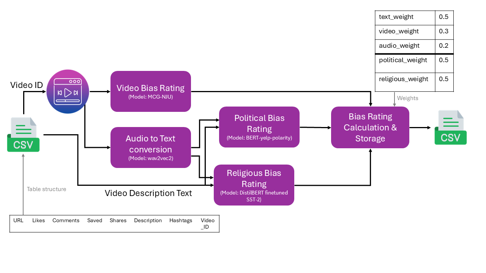

# TikTok Bias Detection Pipeline

A cohesive pipeline for detecting political and religious bias in TikTok videos by analyzing video content, text descriptions, and audio.

## Overview

This project provides a comprehensive pipeline for analyzing TikTok videos for bias. It combines multiple analysis components:

1. **Text Analysis**: Analyzes video descriptions for political and religious bias using BERT-based models.
2. **Video Analysis**: Analyzes video content for visual bias indicators using video feature extraction.
3. **Audio Analysis**: Analyzes speech and audio content for bias using speech recognition and sentiment analysis.
4. **Combined Scoring**: Combines all analysis components with customizable weights to provide final bias scores.



The pipeline produces both individual component scores and a combined bias score for each video, categorizing them from "Minimal Bias" to "Extreme Bias".

## Installation

### Requirements

- Python 3.7 or higher
- PyTorch
- Transformers
- OpenCV
- Librosa
- MoviePy
- Pandas
- NumPy
- scikit-learn

### Install from Source

```bash
# Clone the repository
git clone https://github.com/yourusername/tiktok-bias-detector.git
cd tiktok-bias-detector

# Install dependencies
pip install -r requirements.txt

# Install the package
pip install -e .
```

## Usage

### Python API Example

Here's a comprehensive example of using the TikTok Bias Detection API:

```python
from pipeline import TikTokBiasDetectionPipeline

# Initialize the pipeline
pipeline = TikTokBiasDetectionPipeline()

# Update weights if needed (optional)
pipeline.update_weights(
    text_weight=0.4,
    video_weight=0.4,
    audio_weight=0.2,
    political_weight=0.3,
    religious_weight=0.3
)

# Process a batch of videos
df = pipeline.process_batch(
    input_csv="path/to/your/data_table.csv", 
    data_dir="path/to/video/directory",  
    output_csv="path/to/results.csv"
)

# Print a summary of the results
if df is not None:
    print("\nAnalysis Results Summary:")
    print(f"Total videos analyzed: {len(df)}")
    
    # Get average bias scores
    political_avg = df['political_bias'].mean()
    religious_avg = df['religious_bias'].mean()
    overall_avg = df['overall_bias_score'].mean()
    
    print(f"Average political bias: {political_avg:.2f}")
    print(f"Average religious bias: {religious_avg:.2f}")
    print(f"Average overall bias: {overall_avg:.2f}")
    
    # Count bias categories
    categories = df['overall_bias_category'].value_counts()
    print("\nBias category distribution:")
    for category, count in categories.items():
        print(f"  {category}: {count}")
```

### Command Line Interface

#### Batch Processing

```bash
# Process all videos listed in a CSV file
python main.py --input data/data_table.csv --output data/results.csv

# Customize weights for different analysis components
python main.py --input data/data_table.csv --text-weight 0.4 --video-weight 0.4 --audio-weight 0.2
```

#### Single Video Analysis

```bash
# Analyze a single video
python main.py --video path/to/video.mp4 --description "Video description text"
```

## Input Format

The input CSV file should have the following columns:

- `Video_ID`: Unique identifier for each video
- `Description`: Text description of the video
- `Url`, `Likes`, `Comments`, etc.: Additional metadata (optional)

Videos should be stored in the `data/` directory with filenames matching the Video_ID (e.g., `12345.mp4`).

## Output Format

The output CSV includes all original columns plus:

- `text_political_bias`, `text_religious_bias`, `text_combined_bias`: Text analysis scores
- `video_political_bias`, `video_religious_bias`, `video_combined_bias`: Video analysis scores
- `audio_political_bias`, `audio_religious_bias`, `audio_combined_bias`: Audio analysis scores (if enabled)
- `political_bias`, `religious_bias`, `overall_bias_score`: Combined final scores
- `political_bias_category`, `religious_bias_category`, `overall_bias_category`: Categorization of bias levels

## Configuration

Weights can be customized through command-line arguments, the Python API, or via a JSON configuration file:

```json
{
  "text_weight": 0.4,
  "video_weight": 0.4,
  "audio_weight": 0.2,
  "political_weight": 0.3,
  "religious_weight": 0.3
}
```
